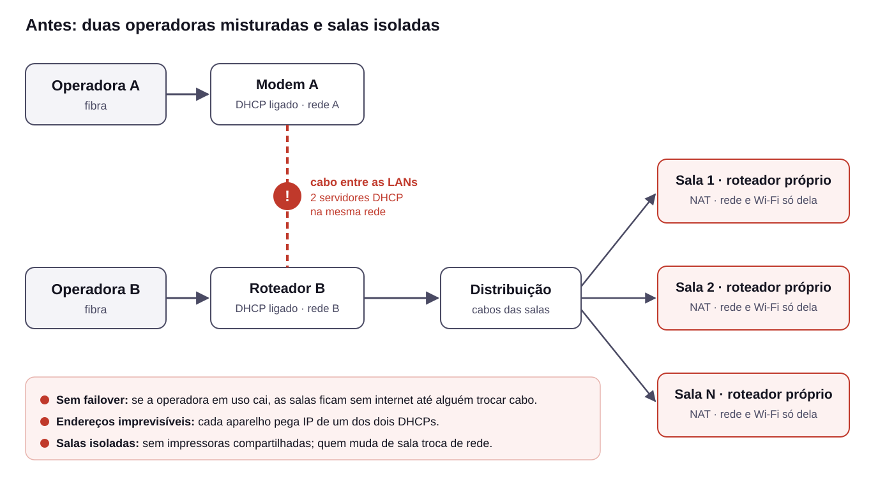
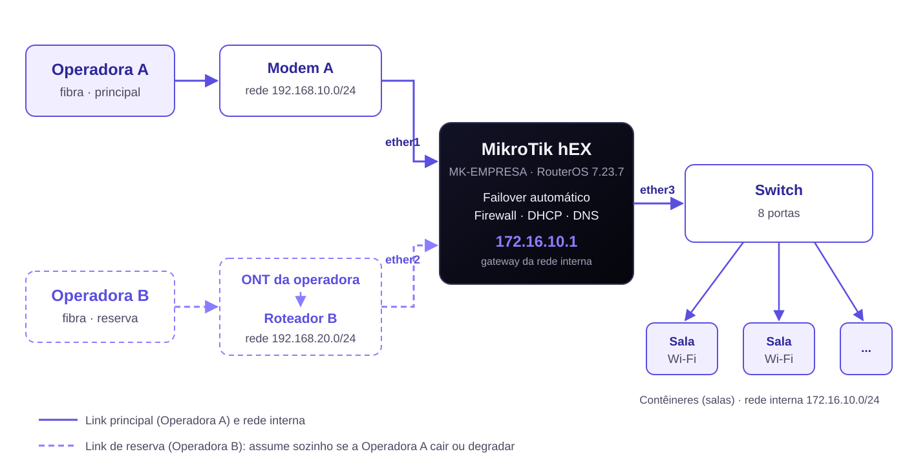
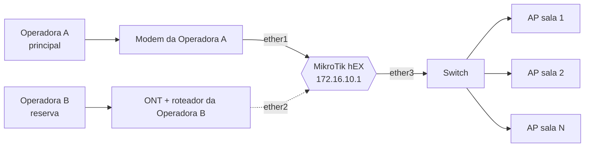

# Dual-WAN com failover automático em MikroTik hEX

**Caso prático:** empresa operando em contêineres, com dois links de fibra (Operadora A e Operadora B) e cada sala numa rede isolada. Solução com um MikroTik hEX como roteador central, failover recursivo entre as operadoras e uma rede interna única para todas as salas.


---

## O cenário



- **Dois links, nenhum failover.** Operadora A e Operadora B, cada uma com seu roteador. Quando a operadora em uso caía, as salas ficavam sem internet até alguém trocar cabo.
- **Redes misturadas.** O modem da Operadora A estava ligado na LAN do roteador da Operadora B: dois servidores DHCP na mesma rede, cada aparelho pegando IP de um lado.
- **Salas isoladas.** Cada contêiner tinha seu roteador em modo roteador (NAT próprio). Uma sala não enxergava a impressora da outra, e quem andava entre salas trocava de IP e de Wi-Fi.

## A solução

Um **MikroTik hEX** no centro: cada operadora entra numa porta própria e as salas saem por uma única porta, através de um switch.





| Porta | Ligada em | Papel |
|---|---|---|
| `ether1` | Modem da Operadora A (LAN) | WAN principal, DHCP client |
| `ether2` | Roteador da Operadora B (LAN) | WAN reserva, DHCP client |
| `ether3` | Switch → salas | Rede interna `172.16.10.0/24` (bridge) |
| `ether4`, `ether5` | Livres | Manutenção / AP da sala do rack |

**Três peças fazem o trabalho:**

1. **Failover recursivo.** Cada operadora é testada contra um IP público que só sai por ela (`208.67.222.222` pela Operadora A, `9.9.9.9` pela Operadora B). A rota padrão da Operadora A (distância 1) só fica ativa se esse teste responder; a da Operadora B (distância 2) assume quando ela cai. Isso detecta o caso clássico de "modem ligado, mas sem internet", que o `check-gateway` comum não pega.
2. **Netwatch de qualidade.** A cada 15 s, 10 pings pela Operadora A. Perda acima de 30% ou latência média acima de 300 ms tira a Operadora A de uso, mesmo sem queda total. Na troca, as conexões são limpas para os apps reconectarem pelo link novo.
3. **Rede única com APs.** O hEX entrega `172.16.10.0/24` para todas as salas. Os roteadores dos contêineres viram **pontos de acesso** com o mesmo nome e senha de Wi-Fi: quem anda entre salas mantém a conexão, e qualquer PC enxerga as impressoras de qualquer sala. A primeira sala já opera assim; as demais seguem o [guia de pontos de acesso](docs/pontos-de-acesso.md).

Mais: firewall stateful, NAT por operadora, gerência só pela rede interna, serviços desnecessários desligados e usuário `admin` desativado. Detalhes em [docs/arquitetura.md](docs/arquitetura.md).

## Resultados

| Teste em produção | Resultado |
|---|---|
| Operadora A e Operadora B conectadas | ✅ `bound` / `bound` |
| Queda simulada da Operadora A | ✅ Operadora B assumiu sozinha, IP público mudou |
| Retorno | ✅ voltou sozinha para a Operadora A |
| Wi-Fi de uma sala de ponta a ponta | ✅ IP `172.16.10.x` do hEX, saída `hEX → Operadora A → internet` |


*Representação do teste feito em produção. Os valores são ilustrativos.*

## Como usar os arquivos

```
.
├── failover.rsc                 # configuração completa do hEX
└── docs/
    ├── arquitetura.md           # portas, IPs, failover, firewall, acessos
    ├── operacao.md              # checagens, teste de failover, backup, problemas, plano B
    ├── implantacao-em-campo.md  # execução real: problemas encontrados e soluções
    ├── pontos-de-acesso.md      # converter o roteador de cada sala em AP
    ├── cola-de-comandos.md      # todos os comandos por etapa
    ├── ajustes-da-revisao.md    # revisão do plano antes da ida a campo
    ├── changelog.md
    ├── exemplos/                # scripts prontos (checagem, teste de failover, reservas, backup...)
    ├── guia/                    # guia passo a passo (HTML interativo e PDF)
    └── img/                     # topologia, cenário anterior, prints de validação
```

### Aplicar a configuração num hEX

1. Atualize o RouterOS para a linha 7 (vindo do 6: `/system package update set channel=upgrade`).
2. Envie `failover.rsc` em *Files* e mova para a pasta `flash/`:
   ```routeros
   /file set [find name="failover.rsc"] name="flash/failover.rsc"
   ```
3. Resete aplicando o script no boot:
   ```routeros
   /system reset-configuration no-defaults=yes skip-backup=yes run-after-reset=flash/failover.rsc
   ```
4. Confira no *Log*: `failover.rsc aplicado com sucesso` e `NETWATCH OK`.
5. Conecte numa porta `ether3–5`, crie seu usuário administrativo e desative o `admin`.

> Ajuste antes: faixa da rede interna, nomes das interfaces e hosts de teste, se o seu cenário for diferente. As faixas das duas operadoras precisam ser **diferentes** entre si.

### Conferir se está tudo certo

```routeros
/ip dhcp-client print                     # as duas WANs em "bound"
/ip route print where comment~"DEFAULT"   # OPA-DEFAULT com "A"
/tool netwatch print                      # OPA-MON "up"
```

Teste de failover, reservas de IP e backup em [docs/exemplos/](docs/exemplos/). O passo a passo completo, do preparo à entrega, está no [guia](docs/guia/guia-implantacao.html): baixe e abra no navegador.

## Lições de campo

- **`hw-offload=yes` na regra de fasttrack não existe no RB750Gr3** e interrompe o script no meio. Removido.
- **Do RouterOS 6 para o 7**, o canal é `upgrade`, não `stable`. No 6, use o Winbox 3.
- **No RouterOS 7 desse modelo, arquivos fora de `flash/` podem sumir no reboot**: o `run-after-reset` precisa apontar para `flash/`.
- **Notebook sem porta de rede** dá para resolver: um roteador Wi-Fi ligado na bridge e IP fixo no Wi-Fi do notebook.
- **Um cabo defeituoso** entre o hEX e o switch pareceu problema de configuração. Luz apagada nas duas pontas = cabo.

Relato completo em [docs/implantacao-em-campo.md](docs/implantacao-em-campo.md).

## Segurança e privacidade

- Endereços IP, nomes de rede e demais valores deste repositório são **ilustrativos**. A lógica é a da implantação real; os dados do cliente não são publicados.
- Nenhuma senha, backup (`*.backup`) ou export com credenciais é versionado. O [.gitignore](.gitignore) bloqueia esses arquivos.

---

Projeto e implantação: **Nebula Host** · Consultoria em Tecnologia
