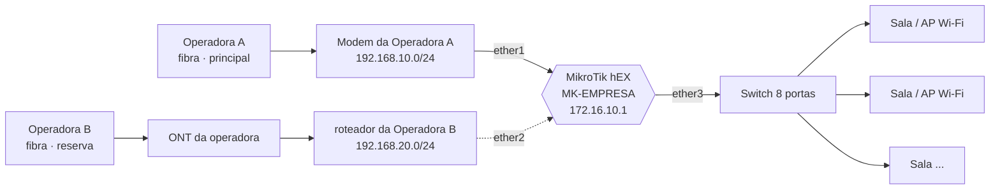

# Arquitetura da rede

Referência técnica do ambiente implantado em 26/09/2026. Use este documento para qualquer alteração futura.

> Endereços, nomes e valores deste repositório são **ilustrativos**: a lógica é a da implantação real, os dados não.

## Visão geral

O MikroTik hEX é o roteador central. Cada operadora entra numa porta própria (WAN) e as salas saem por uma única porta (LAN), através do switch.

## Equipamento

| Item | Valor |
|---|---|
| Modelo | MikroTik hEX **RB750Gr3** (MMIPS, 5 portas gigabit) |
| Identidade | `MK-EMPRESA` |
| RouterOS | **7.23.7 (long-term)** · firmware 7.23.7 |
| Fuso / NTP | `America/Sao_Paulo` · `a.st1.ntp.br`, `b.st1.ntp.br` |
| DNS do roteador | `1.1.1.1`, `8.8.8.8` (cache 4 MiB, atende a LAN) |

## Portas

| Porta | Nome no RouterOS | Ligada em | Papel |
|---|---|---|---|
| ether1 | `ether1-OPA` | Porta LAN do modem da Operadora A | WAN principal (DHCP) |
| ether2 | `ether2-OPB` | Porta LAN do roteador da Operadora B | WAN reserva (DHCP) |
| ether3 | `bridge-LAN` | Switch de 8 portas | Rede interna (**um cabo só**) |
| ether4 | `bridge-LAN` | Livre | Manutenção / AP da sala do rack |
| ether5 | `bridge-LAN` | Livre | Reserva |

> ether3, ether4 e ether5 estão na mesma bridge. **Nunca** ligue duas delas no mesmo switch: fecha um laço.

## Endereçamento

### Rede interna `172.16.10.0/24`

| Faixa | Uso |
|---|---|
| `172.16.10.1` | hEX: gateway e DNS |
| `172.16.10.11` – `.49` | Equipamentos Wi-Fi das salas em modo AP (sala N = `.1N`) |
| `172.16.10.50` – `.79` | Impressoras, ponto, DVR, servidores (reserva por MAC) |
| `172.16.10.100` – `.250` | Pool DHCP automático (151 endereços, lease 8 h) |

### Redes das operadoras (lado WAN)

| Operadora | Rede | Gateway | IP do hEX |
|---|---|---|---|
| Operadora A | `192.168.10.0/24` | `192.168.10.1` | DHCP |
| Operadora B | `192.168.20.0/24` | `192.168.20.1` (roteador) | DHCP + fixo `192.168.20.250` (gerência) |

A Operadora B entrega CGNAT (`100.64.0.0/10`) na WAN do roteador da Operadora B. Não interfere no failover.

## Failover

Duas camadas trabalham juntas:

**1. Rotas recursivas (disponibilidade).** Cada operadora é testada contra um IP público que só sai por ela. Se o teste não responde, a rota cai sozinha, o que detecta "modem ligado, mas sem internet".

| Comentário | Destino | Gateway | Distância | Função |
|---|---|---|---|---|
| `OPA-CHECK` | `208.67.222.222/32` | gateway da Operadora A | 1 | host de teste da Operadora A (OpenDNS) |
| `OPB-CHECK` | `9.9.9.9/32` | gateway da Operadora B | 1 | host de teste da Operadora B (Quad9) |
| `OPA-DEFAULT` | `0.0.0.0/0` | `208.67.222.222` | **1** | internet principal (`check-gateway=ping`) |
| `OPB-DEFAULT` | `0.0.0.0/0` | `9.9.9.9` | **2** | internet reserva (`check-gateway=ping`) |

Os gateways de `OPA-CHECK` e `OPB-CHECK` são atualizados automaticamente pelo script de cada DHCP client quando o lease renova.

**2. Netwatch `OPA-MON` (qualidade).** A cada 15 s envia 10 pings pela Operadora A.

| Limite | Valor |
|---|---|
| Perda | > 30% |
| Latência média | > 300 ms |
| Latência máxima | > 2 s |
| Jitter / desvio | > 1 s / > 500 ms |

Estourou → desativa `OPA-DEFAULT` e limpa as conexões (apps reconectam pela Operadora B). Normalizou → reativa e limpa de novo.

> `208.67.222.222` e `9.9.9.9` são **exclusivos do monitoramento**. Não use como DNS no roteador.

## Firewall

| Cadeia | Comentário | Ação |
|---|---|---|
| input | `IN: estabelecidas` | accept |
| input | `IN: invalidas` | drop |
| input | `IN: ping` | accept |
| input | `IN: gerencia/DNS/DHCP so pela LAN` | accept |
| input | `GERENCIA-VIA-OPB` (origem `192.168.20.0/24` na ether2) | accept |
| input | `IN: dropa o resto (WAN)` | drop |
| forward | `FW: fasttrack` | fasttrack |
| forward | `FW: estabelecidas` | accept |
| forward | `FW: invalidas` | drop |
| forward | `FW: bloqueia novas vindas da WAN` | drop |
| srcnat | `NAT OPA` / `NAT OPB` | masquerade |

## Serviços e acesso

| Serviço | Estado |
|---|---|
| Winbox, SSH | Ativos, só de `172.16.10.0/24` e `192.168.20.0/24` |
| Telnet, FTP, WWW, API, API-SSL | Desativados |
| MAC-Winbox, MAC-Server, Neighbor Discovery | Somente lista `LAN` |
| Usuário `admin` | Desativado |
| Usuário administrativo | usuário próprio (grupo `full`) · credenciais fora do repositório |

| De onde | Endereço no Winbox |
|---|---|
| Wi-Fi/cabo das salas (rede interna) | `172.16.10.1` |
| Wi-Fi do roteador da Operadora B (Operadora B) | `192.168.20.250` |
| Wi-Fi da Operadora A / internet | bloqueado por projeto |

## Wi-Fi

| Rede | Origem | Situação |
|---|---|---|
| Wi-Fi das salas | APs nos contêineres, ligados ao switch | Rede interna, com failover. A primeira sala já opera como AP |
| Wi-Fi do modem da Operadora A | Modem da Operadora A (sala do rack) | Mantido por decisão operacional; sai direto pela Operadora A |
| Wi-Fi do roteador da Operadora B | roteador da Operadora B (sala do rack) | Mantido; também é o caminho de manutenção do hEX |

Os Wi-Fi da sala do rack ficam **fora** da rede interna: funcionam, mas sem failover automático e sem ver as impressoras das salas. Para levar a rede interna à sala do rack, ligue um AP na `ether4` (ver [pontos-de-acesso.md](pontos-de-acesso.md)).
