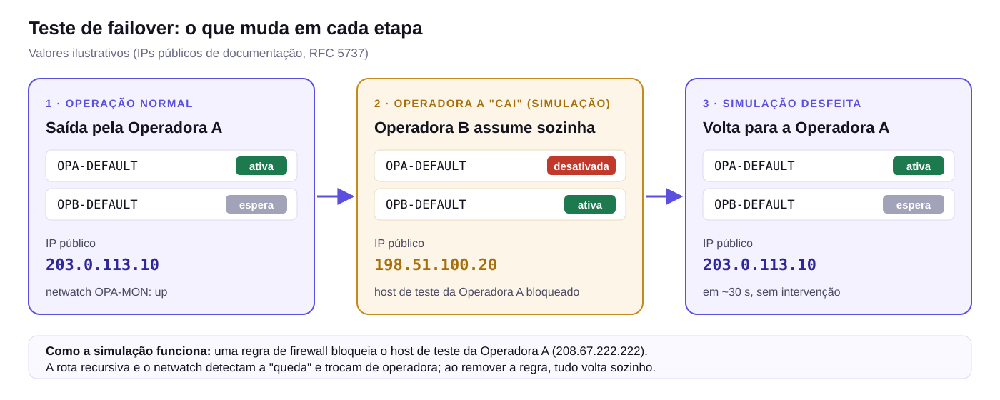

# Operação e manutenção

Guia do dia a dia: como acessar, conferir, testar, fazer backup e resolver problemas. Os comandos prontos estão em [`docs/exemplos/`](exemplos/).

## Acessar o hEX

1. Baixe o **Winbox 4** em [mikrotik.com/download](https://mikrotik.com/download).
2. Conecte o notebook numa rede que tenha acesso:
   - **Wi-Fi ou cabo de uma sala** → Winbox em `172.16.10.1`
   - **Wi-Fi do roteador da Operadora B (Operadora B)** → Winbox em `192.168.20.250`
3. Login com o usuário administrativo (credenciais entregues ao cliente, fora deste repositório).

> Pelo Wi-Fi da Operadora A o acesso é **bloqueado de propósito**. Pelo caminho do roteador da Operadora B o hEX não aparece na aba *Neighbors*: digite o IP.

**Regra prática:** comando que começa com `/` vai no **New Terminal do Winbox**. `ipconfig`, `ping`, `netsh` vão no **CMD do Windows**.

## Checagem rápida (2 minutos)

Script: [`01-checagem-rapida.rsc`](exemplos/01-checagem-rapida.rsc).

| Comando | Resultado esperado |
|---|---|
| `/ip dhcp-client print` | `OPA` e `OPB` em **bound** |
| `/ip route print where comment~"DEFAULT"` | `OPA-DEFAULT` com **A** (ativa) |
| `/tool netwatch print` | `OPA-MON` **up** |
| `/ip dhcp-server lease print` | Aparelhos das salas com `172.16.10.x` |

Exemplo de saída saudável (valores ilustrativos):

```text
/ip dhcp-client print
 # INTERFACE          STATUS  ADDRESS
 0 ether1-OPA        bound   192.168.10.50/24
 1 ether2-OPB    bound   192.168.20.50/24

/ip route print where comment~"DEFAULT"
 #    DST-ADDRESS  GATEWAY          DISTANCE
 ;;; OPA-DEFAULT
 0 As 0.0.0.0/0    208.67.222.222   1        <- "A" = rota ativa
 ;;; OPB-DEFAULT
 1  s 0.0.0.0/0    9.9.9.9          2        <- em espera
```

## Testar o failover

Script: [`02-teste-failover.rsc`](exemplos/02-teste-failover.rsc). Simula a queda da Operadora A bloqueando o host de teste, confere a troca e desfaz.



*Na implantação: a rota da Operadora A foi desativada (`X`), a da Operadora B assumiu (`A`) e o IP público mudou. Ao desfazer, voltou sozinha para a Operadora A. Valores ilustrativos.*

> **Sempre** rode o passo de remoção (`TESTE-FAILOVER`) e confira que a busca vem vazia.

## Testar uma sala de ponta a ponta

No notebook conectado ao Wi-Fi de uma sala:

```bat
ipconfig
tracert -d -h 3 8.8.8.8
```

- **IPv4 `172.16.10.x` e gateway `172.16.10.1`:** o AP da sala está em modo ponto de acesso (ideal).
- **Salto 1 ou 2 = `172.16.10.1`:** a sala sai pelo hEX. ✅
- **Passa por `192.168.10.1` ou `192.168.20.1` sem `172.16.10.1`:** o notebook está num Wi-Fi da sala do rack (fora da rede interna).

Exemplo de resultado correto (valores ilustrativos):

```text
Endereço IPv4 . . . . : 172.16.10.150
Gateway Padrão  . . . : 172.16.10.1

  1    3 ms   172.16.10.1      <- hEX
  2    4 ms   192.168.10.1     <- modem da Operadora A
  3    ...    internet
```

## Backup

Script: [`07-backup.rsc`](exemplos/07-backup.rsc). Gere após **qualquer** alteração e baixe em *Files › Download*.

| Arquivo | Conteúdo | Onde guardar |
|---|---|---|
| `config-final.backup` | Cópia completa, inclusive usuários e senhas | Nuvem privada da empresa. **Nunca no GitHub** |
| `config-final.rsc` | Configuração em texto | Nuvem privada |
| [`failover.rsc`](../failover.rsc) | Script padrão da implantação | Este repositório |

Restaurar no mesmo hEX: *Files › selecionar o `.backup` › Restore*.

## Problemas comuns

| Sintoma | O que fazer |
|---|---|
| Uma sala sem internet | Desligar e ligar o roteador/AP da sala (1 min). Conferir o cabo dele no switch e a luz da porta |
| Todas as salas sem internet | Conferir luzes do hEX (portas 1, 2, 3) e do switch. Rodar a checagem rápida |
| `OPA` em `searching` no dhcp-client | Modem da Operadora A sem DHCP: usar [`06-operadora-a-ip-estatico.rsc`](exemplos/06-operadora-a-ip-estatico.rsc) |
| Sem luz na porta 3 (hEX ↔ switch) | Reencaixar o cabo; trocar de porta no switch; **trocar o cabo** (foi o defeito encontrado na implantação) |
| Internet lenta, sem cair | Ver o Log: `OPERADORA A FORA/DEGRADADA` indica troca por qualidade. Normal durante instabilidade da Operadora A |
| Não entra no Winbox | Conferir em qual Wi-Fi está (`ipconfig`): salas → `172.16.10.1`; roteador da Operadora B → `192.168.20.250`; Operadora A → bloqueado |
| Roteador de sala resetado distribuindo IP | Aparece `DHCP INTRUSO` no Log se [`05-alerta-dhcp-intruso.rsc`](exemplos/05-alerta-dhcp-intruso.rsc) estiver aplicado. Reconfigurar o AP |

## Plano B (≈ 5 minutos)

Use só se o hEX apresentar defeito:

1. Desligar o hEX da tomada.
2. Ligar o cabo que vem da **LAN do roteador da Operadora B** (hoje na `ether2`) direto no **switch**.
3. Aguardar 2 minutos: as salas navegam pela Operadora B, sem failover.

A configuração fica salva no hEX. Ao devolver os cabos às posições de [arquitetura.md](arquitetura.md#portas), tudo volta.

## Atualizar o RouterOS

1. Gerar backup e baixar.
2. Fora do horário de uso: `/system package update check-for-updates` e `install` (canal `stable` ou manter a linha *long-term*).
3. `/system routerboard upgrade` e `/system reboot`.
4. Rodar a checagem rápida.
